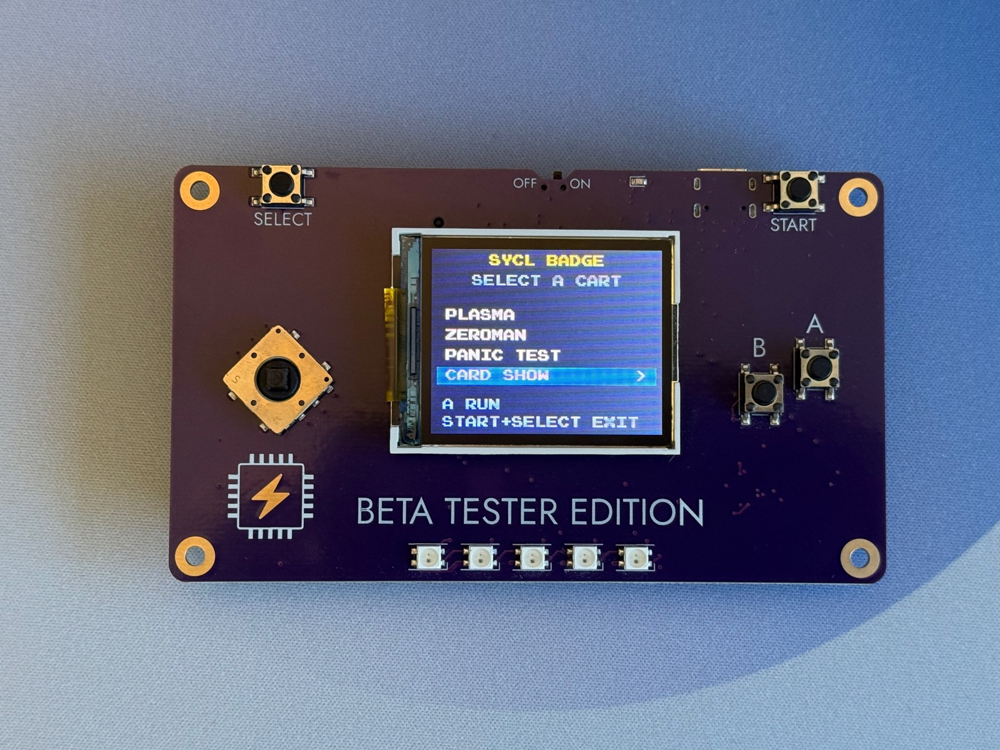
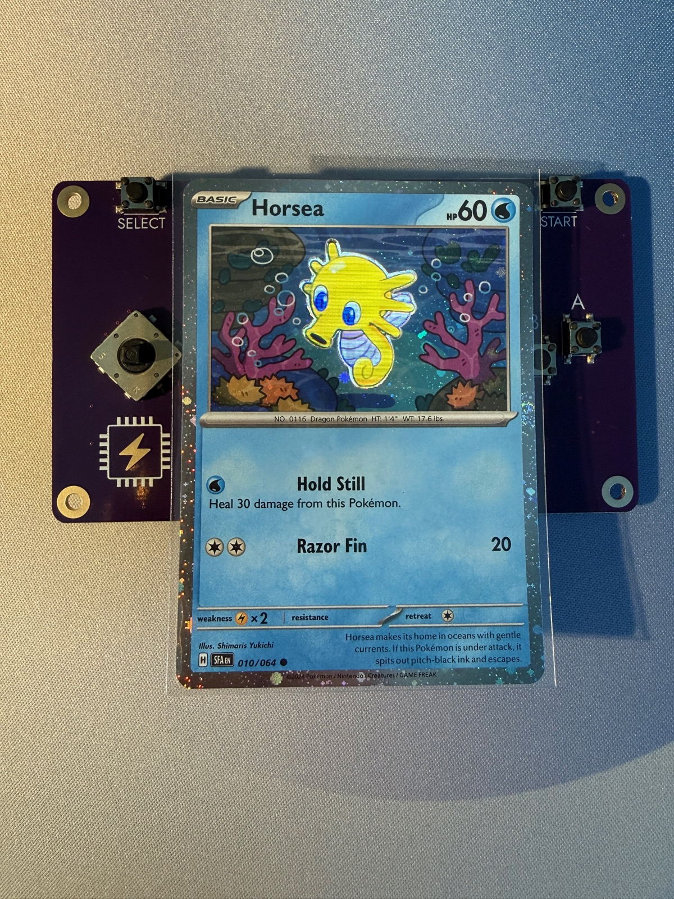
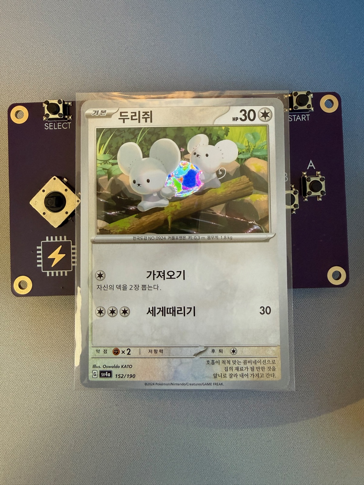

# sycl-badge-tinygo

<p align="center">
  
  
</p>

A minimal TinyGo firmware for the **SYCL Badge V2** — an RP2354B board (48-GPIO
RP2350B die, 2 MB in-package flash) running the SYCL 2026 production
(revision 2) hardware.

On boot it lights up a physical trading card laid on its 160×128 LCD — the
**CARD SHOW** shinethrough lightshow — then becomes a **cartridge menu**. Press
**A** to launch a cartridge, and hold **Start+Select** for 250 ms to return.
Cartridges are Go values compiled into this one firmware; there is no UF2
loader, no second app core, and no second runtime.

> **This is a hobby project.** Code here is largely AI-generated and not
> guaranteed to be human-reviewed. See [AI_USAGE.md](AI_USAGE.md) before flashing
> anything.

## CARD SHOW

CARD SHOW is the main attraction: a physical trading card laid over the panel,
lit **through** from behind. Light diffuses through the card stock, so the show
does not reproduce the art — it drives a coarse, soft **glow mask** derived from
the art box, tinted by a small palette and animated by independent effect layers
(breathing, a diagonal holo sweep, drifting sparkles, an A-button flash), then
mapped through one of ten colour looks. Select shows an alignment overlay so the
glow can be lined up under the printed art.

<p align="center">
  
  
  
</p>

Two different cards, same show: each is a photograph of a real card held over the
panel and lit from behind. Full detail — effects, colour modes, the effects menu,
asset generation, and calibration — is in [docs/cards.md](docs/cards.md).

> **Card imagery.** Card source images and the generated assets are **not**
> committed; they live in a gitignored, per-user library, and a fresh clone
> builds the original synthetic sample instead. The card photographs here are of
> physical hardware, not redistributed artwork. See [docs/cards.md](docs/cards.md)
> and [docs/toolchain.md](docs/toolchain.md#one-card-library-across-worktrees).

## Quick start

```sh
make build      # -> hello.uf2 + hello.elf
make flash      # copy hello.uf2 to the badge's BOOTSEL drive
make monitor    # watch the USB-CDC serial output
make sim        # run the cartridge runtime on the host, render PNG frames
make sim-ui     # run it interactively in a browser window (keyboard + buttons)
make test       # host-side unit tests for the cartridge runtime
```

New to the codebase? Read [How it works](#how-it-works) and the
[cartridge runtime](#cartridge-runtime), then dip into [`docs/`](docs/) as
needed.

## Cartridges

The badge boots straight into **CARD SHOW** (see above) so the lightshow is up
with no button press; **Start+Select** exits to the menu.

| Cart | What it is |
| --- | --- |
| **CARD SHOW** | The hero cart. Backlights a physical card laid on the LCD with a glow mask, animation effects, and a colour-look cycle. Boots on. |
| **PLASMA** | A full-screen animated plasma effect. |
| **ZEROMAN** | A port of the reference firmware's platformer. |
| **TASKS** | Show and tell: goroutines on the cooperative scheduler, including a deliberate no-yield stall and a fatal goroutine panic. |
| **HEAP** | Show and tell: the GC drawn from `ReadMemStats`, with an armed demo that exhausts the heap. |
| **PANIC TEST** | A diagnostic that panics on its first frame to exercise the recover path. |

`TASKS` and `HEAP` are teaching aids, not production code: live numbers and
deliberately fatal paths are the point. They are covered in
[docs/go-demos.md](docs/go-demos.md). CARD SHOW is still the hero — the badge
still boots straight into it.

## How it works

The runtime swaps Go-valued cartridges inside one firmware. It ports the
*contract* from the Zig reference firmware, not its loader: each cart implements
`Start(p *Platform)` (once per launch) and `Update(p *Platform)` (once per
frame), and the platform owns machine init, the ST7735S driver, button polling,
and the same-core SPI flush of a package-level 160×128 RGB565 backbuffer.
Present is a function call, not a queue.

The deliberate split:

- **`main.go` and `display.go`** are the only hardware code: display init, the
  panel driver, and the injected `Display`/`Env` adapters (`hw.go`, `env_hw.go`).
- **`cartridge/`** is deliberately hardware-free. It imports no `machine`, so
  the menu, launch/exit, fresh-`Start`, and panic-recovery paths are covered by
  `make test` and rendered by `make sim`, and `make sim-ui` runs the very same
  `Runner` at ~60 fps with only the panel and pins replaced.

```
main.go              hardware side
display.go           ST7735S panel driver + backlight PWM
hw.go, env_hw.go     adapt panel/buttons to cartridge.Display/Env
cartridge/           hardware-free runtime + carts
cmd/sim, cmd/simui   host renderer + interactive simulator
tools/*.py           build-time asset generators
targets/             custom TinyGo target + board constants
```

For why it is shaped this way — the two cores, where the runtime lives, when GC
runs, and what a panic actually does — see [docs/architecture.md](docs/architecture.md).

## Cartridge runtime

- A cart implements `Start(p *Platform)` once per launch and
  `Update(p *Platform)` once per frame.
- Cart state lives on the cart struct and is rebuilt in `Start`; the runner
  stores factories, not instances, so **every launch is a fresh `Start`** on a
  zero-valued cart. That replaces the Zig BSS wipe. Carts touch no `machine`
  state.
- `Update` runs inside `recover`: a Go `panic` returns to the menu without
  re-initialising the panel. A hard fault or an infinite loop still takes the
  chip down; that is accepted. (A panic *outside* a cart is fatal — see
  [docs/architecture.md](docs/architecture.md).)
- Hold **Start+Select** for 250 ms to exit a cart. The chord is edge-triggered,
  so a chord held across a launch does not bounce straight back. **A** launches
  the highlighted cart; joystick up/down moves the selection.
- The badge **boots straight into CARD SHOW** (`Runner.BootCart` in `main.go`),
  so the lightshow is up with no button press; **Start+Select** exits to the cart
  menu as usual. A host/sim build can skip this and start on the menu.
- The runtime lives in `cartridge/` and is deliberately hardware-free, so the
  whole lifecycle is covered by `make test` and rendered by `make sim`:

```sh
make test   # go test ./cartridge/...
make sim    # writes sim-out/01-menu.png, 03-plasma-later.png, ...
```

### Interactive simulator

`make sim-ui` runs the runtime live instead of scripted: it starts a small HTTP
server on `127.0.0.1`, opens a browser window, and drives the very same
`cartridge.Runner` the badge runs, at the same ~60 fps pace. The window shows the
160×128 panel at an integer zoom and posts the state of its keyboard and
on-screen controls back as the runner's `Env`, so the menu, the launch/exit
chords, panic recovery, and every cart behave exactly as they do on hardware —
only the panel and the pins are replaced.

- **Keyboard (preferred):** arrows or WASD move the joystick, **Z**/**J** is A,
  **X**/**K** is B, **Enter** is Start, **Shift** is Select, **C** is the stick
  click, **Esc** releases everything. Hold **Start+Select** for 250 ms to leave a
  cart.
- The teaching carts also use A/B/click: **TASKS** uses A for the no-yield
  greedy demo and B twice for the goroutine panic; **HEAP** uses A to allocate,
  B to free+collect, the stick click to leak, and a held A+B to exhaust the heap
  (see [docs/go-demos.md](docs/go-demos.md)).
- The green dot shows the live frame stream; the backlight percentage follows the
  carts that dim or pulse the panel (e.g. the card lightshow).

The sim shows your **real cards** without a rebuild: at startup it runs the very
same `tools/make_card.py` the firmware build uses, on the shared card library,
and loads the assets it emits. The banner reports which set was loaded; with no
manifest (or no Python/Pillow) it falls back to the cards already baked into the
binary.

Extra flags pass through, e.g.
`make sim-ui SIMUI_FLAGS="-addr 127.0.0.1:8423 -open=false"` or
`make sim-ui SIMUI_CARDS=~/my-cards`, or run `go run ./cmd/simui` directly.

## Repository layout

| Path | Role |
| --- | --- |
| `main.go` | Program entry: display init, cart factories, `Runner`, `BootCart`, `Run`. |
| `display.go` | Self-contained ST7735S driver (SPI0) and backlight PWM. |
| `hw.go`, `env_hw.go` | Adapt the panel and buttons to `Display`/`Env`. |
| `env_demo.go` | `-tags=cartdemo` scripted buttons, for bring-up without hands. |
| `cartridge/` | Hardware-free runtime: interface, menu/launch/recover loop, and carts (`registry.go` holds the shared library). |
| `cmd/sim` | Scripted host renderer (writes PNG frames). |
| `cmd/simui` | Interactive host simulator (browser window). |
| `tools/` | Build-time asset generators (cards, zeroman art/stage, gopher). |
| `targets/` | Custom TinyGo target and the badge's board constants. |
| `assets/`, `gopher_data.go` | Source image and generated RGB565 gopher art. |
| `docs/` | Deep-dive documentation (see [docs/](docs/)). |

## Build and flash

The badge exposes a UF2 mass-storage bootloader. The volume (`RP2350`) is only
mounted in BOOTSEL mode — hold `RESET` + `BOOT_SEL`, release `RESET`, then
release `BOOT_SEL`.

```sh
make build      # build hello.uf2 and hello.elf
make size       # flash/RAM usage
make flash      # copy hello.uf2 to /Volumes/RP2350
make monitor    # tinygo monitor
make clean      # remove build artifacts
```

The volume unmounts and the badge reboots into the new firmware immediately.

### Prerequisites

- TinyGo 0.42.0 or newer, with Go 1.25–1.27 on `PATH` (TinyGo reuses the system
  Go toolchain).
  - Homebrew: `brew tap tinygo-org/tools && brew install tinygo`
  - Or the release tarball from
    <https://github.com/tinygo-org/tinygo/releases> (macOS Homebrew's bottle may
    refuse to install if your Xcode is older than the bottle expects; the
    tarball avoids that).
- The badge connected over USB.

## Verify

On boot the panel shows **CARD SHOW**. Hold **Start+Select** (250 ms) to reach
the cartridge menu, where `PLASMA` is highlighted. Press **A** to run it; hold
**Start+Select** to return; press **A** again for a fresh start. Push the
joystick down to `ZEROMAN` and press **A**: press a direction or **A** to leave
the title, then move with the joystick and jump (**A**) / shoot (**B**). Push
down to `PANIC TEST` and press **A**: it panics in `Update` and the menu returns
with a `PANIC:` line, proving the recover path.

USB-CDC logs each lifecycle transition (`launch: …`, `exit: start+select`,
`recovered update panic: …`), but only once a serial reader is attached — the
TinyGo USB-CDC drops writes until the host asserts DTR, so boot prints usually
appear only if `make monitor` was already running.

On macOS the port looks like `/dev/cu.usbmodem*`. `make monitor` finds it:

```sh
make monitor                              # uses this target's VID:PID
make monitor PORT=/dev/cu.usbmodemXXXX    # or pick the port explicitly
```

## Going deeper

- **[docs/architecture.md](docs/architecture.md)** — runtime, cores, GC, panics,
  memory.
- **[docs/display.md](docs/display.md)** — the panel, backlight, and two
  hardware post-mortems.
- **[docs/cards.md](docs/cards.md)** — the CARD SHOW lightshow in full.
- **[docs/zeroman.md](docs/zeroman.md)** — the platformer port.
- **[docs/go-demos.md](docs/go-demos.md)** — the TASKS and HEAP show-and-tell
  carts: goroutines, the cooperative scheduler, the GC, and the fatal paths.
- **[docs/go-demos-in-depth.md](docs/go-demos-in-depth.md)** — run the demos,
  then the real-world failure modes, defenses, and the Zig comparison.
- **[docs/conference-runbook.md](docs/conference-runbook.md)** — rebuilding and
  re-flashing on a fresh MacBook (fresh toolchain + SWD), with a `scripts/`
  setup script and a bring-up checklist.
- **[docs/toolchain.md](docs/toolchain.md)** — custom target, shared cards,
  bring-up self-test, SWD/OpenOCD, serial monitoring, CI.
- **[docs/pokemon-card-holder.md](docs/pokemon-card-holder.md)** — the mechanical
  card-holder design: parts, dimensions, assembly, and how it was built.

## License

MIT — see [LICENSE](LICENSE). The Go gopher was designed by **Renée French**
and is licensed under CC BY 3.0; attribution is carried in the generated
`gopher_data.go` header and must be preserved.
